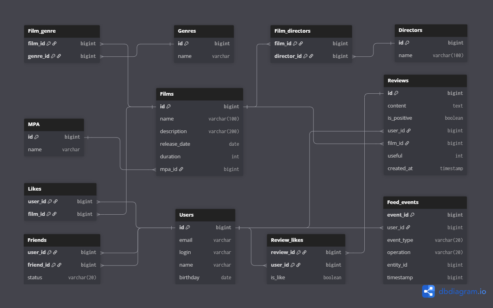

# java-filmorate

Командный проект по разработке приложения Filmorate

## Функциональность

### Фильмы
- Добавление, обновление, удаление фильмов
- Получение всех фильмов
- Получение фильма по ID
- Добавление и удаление лайков
- Получение популярных фильмов (с фильтрацией по жанру и году)
- Получение общих фильмов двух пользователей
- Поиск фильмов по названию и/или режиссёру

### Режиссёры
- Добавление, обновление, удаление режиссёров
- Получение всех режиссёров
- Получение режиссёра по ID
- Получение фильмов режиссёра с сортировкой по году или лайкам

### Отзывы
- Добавление, обновление, удаление отзывов
- Получение отзыва по ID
- Получение всех отзывов к фильму (с пагинацией)
- Добавление и удаление лайков/дизлайков

### Пользователи
- Добавление, обновление, удаление пользователей
- Получение всех пользователей
- Получение пользователя по ID
- Добавление и удаление друзей
- Получение списка друзей
- Получение общих друзей

### Жанры и рейтинги (MPA)
- Получение всех жанров
- Получение жанра по ID
- Получение всех рейтингов MPA
- Получение рейтинга MPA по ID

### Лента событий
- Получение ленты событий пользователя (добавление/удаление друзей, лайки, отзывы)

### Рекомендации
- Получение рекомендаций фильмов для пользователя на основе лайков других пользователей

## Схема базы данных

